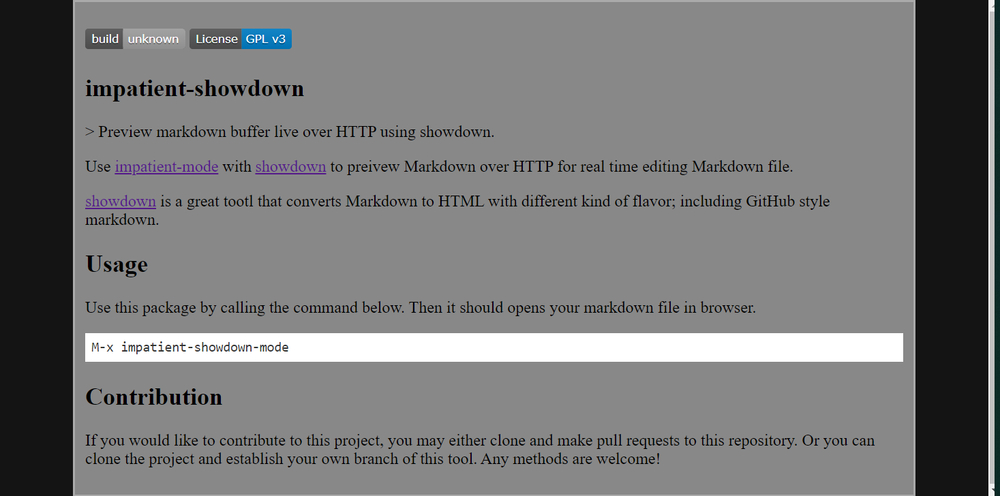

[](https://www.gnu.org/licenses/gpl-3.0)
[](https://melpa.org/#/impatient-showdown)
[](https://stable.melpa.org/#/impatient-showdown)

# impatient-showdown
> Preview markdown buffer live over HTTP using showdown.

[](https://github.com/jcs-elpa/impatient-showdown/actions/workflows/test.yml)

<p align="center">
  
</p>

Use [impatient-mode](https://github.com/skeeto/impatient-mode) with
[showdown](https://github.com/showdownjs/showdown) to preview Markdown over HTTP
for real time editing Markdown file.

[showdown](https://github.com/showdownjs/showdown)
is a great tool that converts Markdown to HTML with different kind of
flavor; including GitHub style markdown.

## 🔧 Usage

Use this package by calling the command below. Then it should opens your markdown
file in browser.

```
M-x impatient-showdown-mode
```

## 🔧 Customization

#### 🧪 Variables

- `impatient-showdown-preview-template` - main preview HTML template file (not encouraged)

> ⚠️ Following variables only work when preview template is using the default template!

- `impatient-showdown-scripts` - List of JavaScript to load.
- `impatient-showdown-links` - List of CSS to load.
- `impatient-showdown-flavor` - markdown flavor (default to` 'original`)
- `impatient-showdown-background-color` - `<body>` background color (default to `"#141414"`)
- `impatient-showdown-markdown-background-color` - markdown background color (default to `"#888888"`)
- `impatient-showdown-markdown-border-color` - markdown border color (default to `"#AAAAAA"`)

## 🛠️ Contribute

[](http://makeapullrequest.com)
[](https://github.com/bbatsov/emacs-lisp-style-guide)
[](https://www.paypal.me/jcs090218)
[](https://www.patreon.com/jcs090218)

If you would like to contribute to this project, you may either clone and make pull
requests to this repository. Or you can clone the project and establish your own
branch of this tool. Any methods are welcome!

### 🔬 Development

To run the test locally, you will need the following tools:

- [Eask](https://emacs-eask.github.io/)
- [Make](https://www.gnu.org/software/make/) (optional)

Install all dependencies and development dependencies:

```sh
eask install-deps --dev
```

To test the package's installation:

```sh
eask package
eask install
```

To test compilation:

```sh
eask compile
```

**🪧 The following steps are optional, but we recommend you follow these lint results!**

The built-in `checkdoc` linter:

```sh
eask lint checkdoc
```

The standard `package` linter:

```sh
eask lint package
```

*📝 P.S. For more information, find the Eask manual at https://emacs-eask.github.io/.*

## ⚜️ License

This program is free software; you can redistribute it and/or modify
it under the terms of the GNU General Public License as published by
the Free Software Foundation, either version 3 of the License, or
(at your option) any later version.

This program is distributed in the hope that it will be useful,
but WITHOUT ANY WARRANTY; without even the implied warranty of
MERCHANTABILITY or FITNESS FOR A PARTICULAR PURPOSE.  See the
GNU General Public License for more details.

You should have received a copy of the GNU General Public License
along with this program.  If not, see <https://www.gnu.org/licenses/>.

See [`LICENSE`](./LICENSE.txt) for details.
